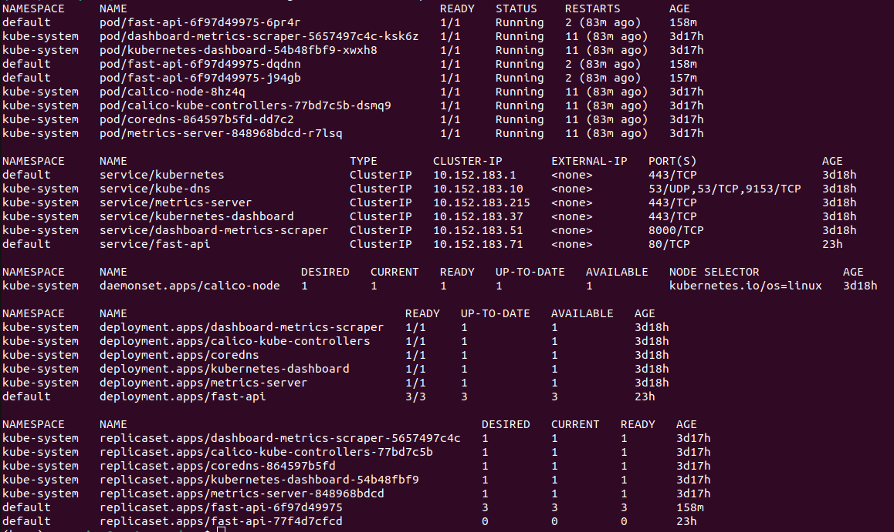

# kube-install-ubuntu
Installing Kubernetes on ubuntu 22.04
# configuration
Your Kubernetes control-plane has initialized successfully!

To start using your cluster, you need to run the following as a regular user:
```
  mkdir -p $HOME/.kube
  sudo cp -i /etc/kubernetes/admin.conf $HOME/.kube/config
  sudo chown $(id -u):$(id -g) $HOME/.kube/config
```
Alternatively, if you are the root user, you can run:
```
  export KUBECONFIG=/etc/kubernetes/admin.conf
```
You should now deploy a pod network to the cluster.
Run "kubectl apply -f [podnetwork].yaml" with one of the options listed at:
  https://kubernetes.io/docs/concepts/cluster-administration/addons/

Then you can join any number of worker nodes by running the following on each as root:

kubeadm join 10.0.0.48:6443 --token q5ntqk.05kj33m40gas8l6e \
	--discovery-token-ca-cert-hash sha256:8fafe327bb8908f4b9f42ca760eeca4c97dc5351fb3972f07971c9526c71afeb 

### install conda for python
download conda from - https://repo.anaconda.com/archive/Anaconda3-2023.09-0-Linux-x86_64.sh
```
wget https://repo.anaconda.com/archive/Anaconda3-2023.09-0-Linux-x86_64.sh
sudo bash Anaconda3-2023.09-0-Linux-x86_64.sh
```
install path - /opt/anaconda3
```
sudo groupadd anaconda
sudo chgrp -R anaconda /opt/anaconda3
sudo adduser scorpion anaconda
source /opt/anaconda3/bin/activate
conda init
```
### install juypter lab
```
pip install jupyterlab
jupyter lab
cd .jupyter
jupyter notebook --generate-config
```
vi jupyter_notebook_config.py
c.NotebookApp.ip = '0.0.0.0'
c.NotebookApp.token = ''

### install microk8s
Microk8 is one of the kubernetes distribution that we can install on ubuntu linux
https://microk8s.io/docs/addon-dashboard

#### after installation setup
all of the microk8 command starts with microk8 kubectl <command>, and to minimise this add an alias to .bashrc script alias m='microk8s'

```
echo "alias vps='microk8s'" >> ~/.bashrc
```

#### to see cluster info
```
m kubectl cluster-info
```
#### to see cluster all namespaces
```
m kubectl get all --all-namespaces
```

#### enable microk8s dashboard
```
m enable dashboard
```
this will add a new namespace to the k8 deployment


#### accessing dashboard

to access the dashboard once it is enabled, find the url with this command.
```
m kubectl describe service/kubernetes-dashboard -n kube-system
```


Check for the endpoint with port 443

Now create a port foward to access it locally
```
m kubectl port-forward -n kube-system service/kubernetes-dashboard 10443:443
```


open a browser and access the address 127.0.0.1:10443 (the port forwared to)

this will open up a webpage that asks for a token


use the command to generate a token
```
m kubectl create token default
```


copy and paste the token to the webpage, and will enable the dashboard


